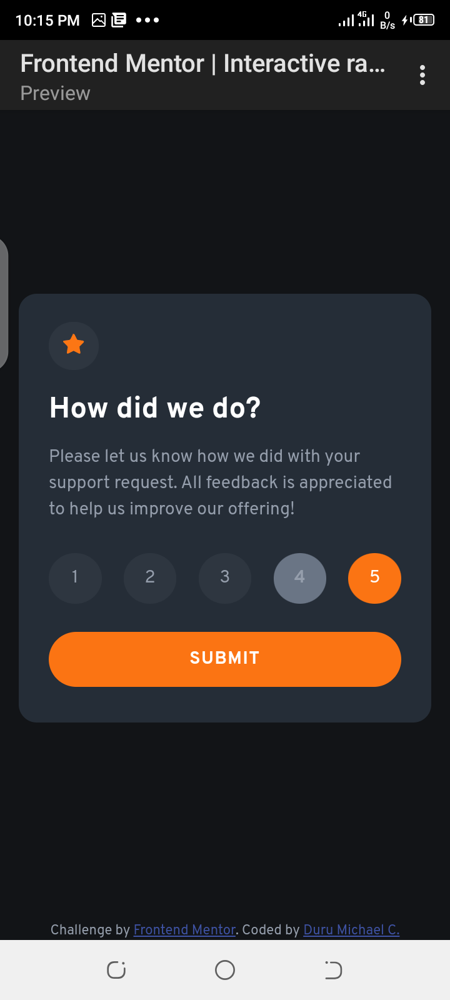
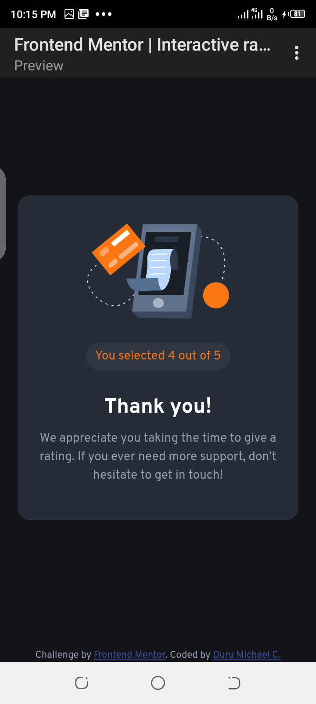

# Frontend Mentor - Interactive rating component solution

This is a solution to the [Interactive rating component challenge on Frontend Mentor](https://www.frontendmentor.io/challenges/interactive-rating-component-koxpeBUmI). Frontend Mentor challenges help you improve your coding skills by building realistic projects. 

## Table of contents

- [Overview](#overview)
  - [The challenge](#the-challenge)
  - [Screenshot](#screenshot)
  - [Links](#links)
- [My process](#my-process)
  - [Built with](#built-with)
  - [What I learned](#what-i-learned)
  - [Continued development](#continued-development)
- [Author](#author)

## Overview

### The challenge

Users should be able to:

- View the optimal layout for the app depending on their device's screen size
- See hover states for all interactive elements on the page
- Select and submit a number rating
- See the "Thank you" card state after submitting a rating

### Screenshot





### Links

- Solution URL: [https://github.com/Mikael-duru/Interactive-rating-component.git](https://github.com/Mikael-duru/Interactive-rating-component.git)
- Live Site URL: [https://mikael-duru.github.io/Interactive-rating-component/](https://mikael-duru.github.io/Interactive-rating-component/)

## My process

### Built with

- Semantic HTML5 markup
- CSS custom properties
- Flexbox
- Mobile code editor (Spck)

### What I learned

I learnt how to let a user select a rating and submit selected rating using JavaScript.

```js
const btns = document.querySelectorAll('[role="button"]');

btns.forEach((btn) => {

  btn.addEventListener('click', (e) => {

    let selectedBtn = e.currentTarget;
    for (let i = 0; i < btns.length; i++) {

      if (btns[i].getAttribute('aria-selected') == 'true') {

        // Sets all rating-btn aria to false
        btns[i].setAttribute('aria-selected', false);
        
        // Sets user selected rating-btn aria to true and increase background opacity
        selectedBtn.setAttribute('aria-selected', true);
        selectedBtn.style.background = 'hsla(216, 12%, 54%, .8)';
        
        // Prints user selected rating value to thank-you box
        selectedRating.textContent = selectedBtn.id;

      }
      else
      {
        selectedBtn.setAttribute('aria-selected', true);
        selectedRating.textContent = selectedBtn.id;
      }
    }

  })
  
});
```

### Continued development

- JavaScript ES6

## Author

- Website - [Add website here](https://www.your-site.com)
- Frontend Mentor - [@mikael-duru](https://www.frontendmentor.io/profile/mikael-duru)
- Twitter - [@DuruMykael](https://www.twitter.com/durumykael)